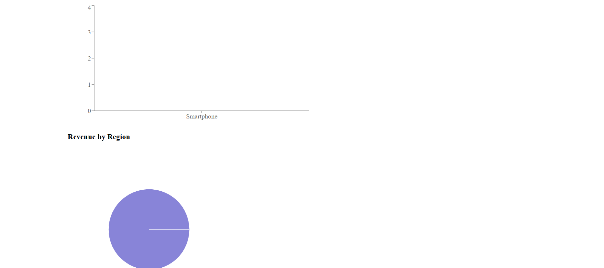
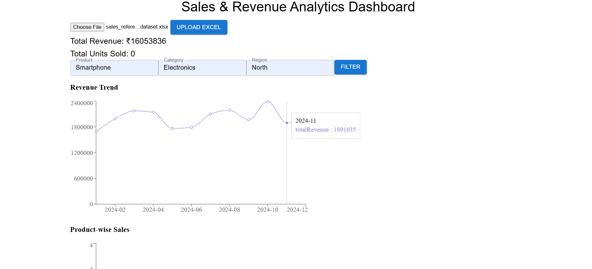

# 📊 Sales & Revenue Analytics Dashboard — Frontend

This is the **React-based frontend** of the Sales & Revenue Analytics Dashboard, which allows users to upload Excel datasets and visualize business metrics in real-time using interactive charts.

> 🔗 Works with a Node.js + MongoDB backend to store and serve sales data.

---

## 🌟 Features

- 📤 **Upload Excel File (.xlsx)**  
  Upload sales data to the backend in real time

- 📈 **Revenue Trend Chart**  
  View revenue growth over time (daily, weekly, monthly)

- 🧮 **Summary Section**  
  Instantly shows total revenue and total units sold

- 🔎 **Dynamic Filters**  
  Filter sales by product, category, and region

- 📊 **Bar & Pie Charts**  
  Visualize product-wise and region-wise sales

- ⚡ **Responsive UI**  
  Optimized for browser-based usage

---

## 📸 Demo UI (Screenshots)

### Upload and Summary View  


### Charts: Revenue Trend, Product-wise, Region-wise  


> Replace `./assets/` with your actual image paths in the repo.

---

## 🛠️ Tech Stack

- **React.js**
- **Axios** (for API calls)
- **Recharts** or **Chart.js**
- **Tailwind CSS** / Bootstrap
- **React Hooks**

---

## 🚀 Getting Started

### 1. Clone Repository

```bash
git clone https://github.com/your-username/sales-dashboard.git
cd sales-dashboard/frontend
